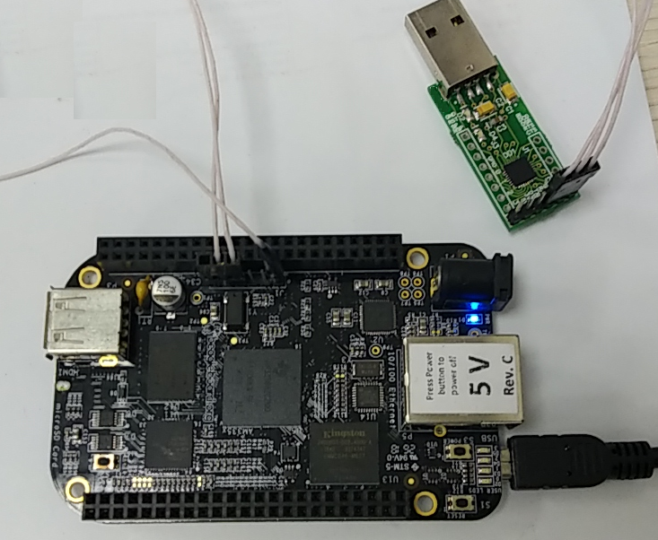

# Learn embedded Linux

I have started to learn embedded Linux and driver devepompemt with the [BeagleBone Black board](https://www.elinux.org/Beagleboard:BeagleBoneBlack). There I will write some usefull notes or commands about work with the BBB or about driver development.

## My study plan

##### 1. Preparation
  - Build set of tools for Cortex A8 ARM
  - Build and flash U-Boot in eMMC memory on board
  - Build the Linux Kernel 
  - Build root file system

##### 2. Learning
  - Learn how to boot the Linux kernel
  - Learn what is device tree table
  - Learn how to write kernel modules

##### 3. Laboratory works from [Bootlin](https://bootlin.com/doc/training/linux-kernel/) about Linux kernel course
  - Make "Hello world" kernel module
  - Make I2C-driver for external I2C-device
  - Make driver avaliable in user-space through `/dev/devname`
  - Realize `fops` struct for i2c-device
  - Realize interrupt handler from the device

##### 4. Try to do some drivers for own soldered board
  - [SPI OLED](https://components101.com/oled-display-ssd1306) display based on ssd1306 controller
  - [Rotary](https://howtomechatronics.com/tutorials/arduino/rotary-encoder-works-use-arduino/)
  - Temperature and humidity sensor [DHT11](https://www.mouser.com/datasheet/2/758/DHT11-Technical-Data-Sheet-Translated-Version-1143054.pdf)
  - RTC I2C based on [DS3231](https://www.maximintegrated.com/en/products/analog/real-time-clocks/DS3231.html) controller
  - Buttons/Leds
  - Ambient light I2C-sensor based on [BH1750](https://www.mouser.com/datasheet/2/348/bh1750fvi-e-186247.pdf) controller
  - Barometric pressure I2C-sensor based on [BMP180](https://cdn-shop.adafruit.com/datasheets/BST-BMP180-DS000-09.pdf) controller
  - Ultrasonic ranging module [HC-SR04](https://cdn.sparkfun.com/datasheets/Sensors/Proximity/HCSR04.pdf)

## Few words about homemade development board
|  |
|:--:|
| *My Frankenstein* |
 > 1. Servomotor, that allows for precise control of angular position
 > 2. Mechanical rotary encoder that converts the angular position to digital output signals
 > 3. Ultrasonic ranging module
 > 4. Power LED
 > 5. SPI OLED display
 > 6. User's GPIO LED
 > 7. Temperature and humidity sensor
 > 8. Seven-segment display
 > 9. User's button
 > 10. Interface to BBB
 > 11. CR2032 batary for RTC
 > 12. RTC
 > 13. Ambient light sensor
 > 14. Barometric pressure sensor

|  |
|:--:|
| *The BBB and UART-USB module* |

## Few word about schematic
I don't know why I have decided to make this ugly board, but I think it doesn't matter for driver development and learning the Linux kernel :)

*in progress*
